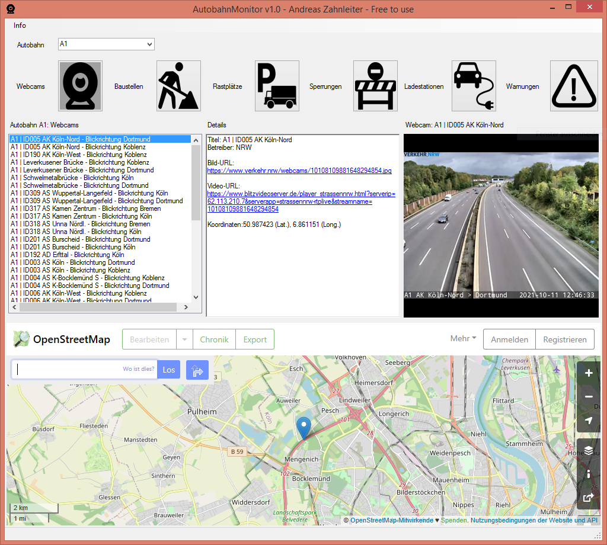

# AutobahnMonitor

Kleine App zur Abfrage von öffentlichen Vekehrsinformationen deutscher Autobahnen (Autobahn App API).

Copyright (c) 2022 Andreas "MrCerealGuy" Zahnleiter <mrcerealguy@gmx.de>

## Download

[Download AutobahnMonitor v1.1](https://github.com/MrCerealGuy/AutobahnMonitor/releases/download/v1.1/AutobahnMonitor_v1.1.zip)